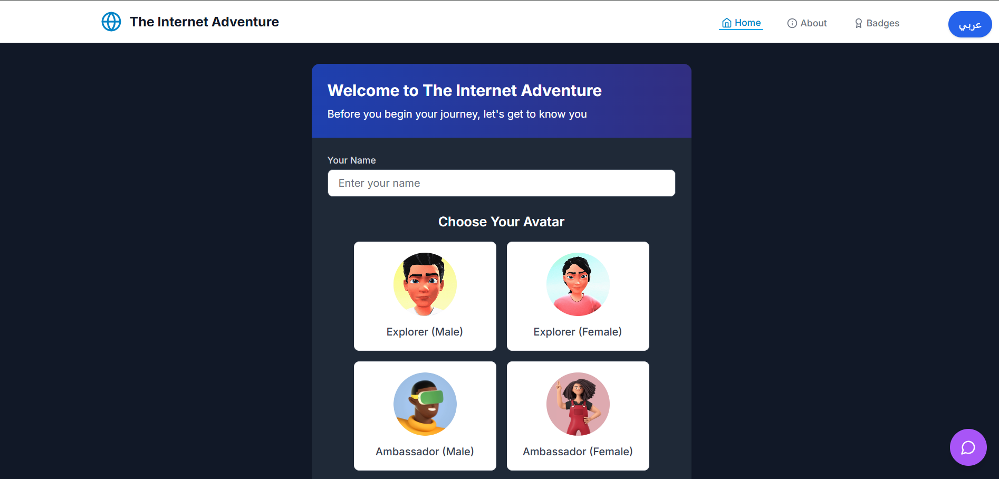
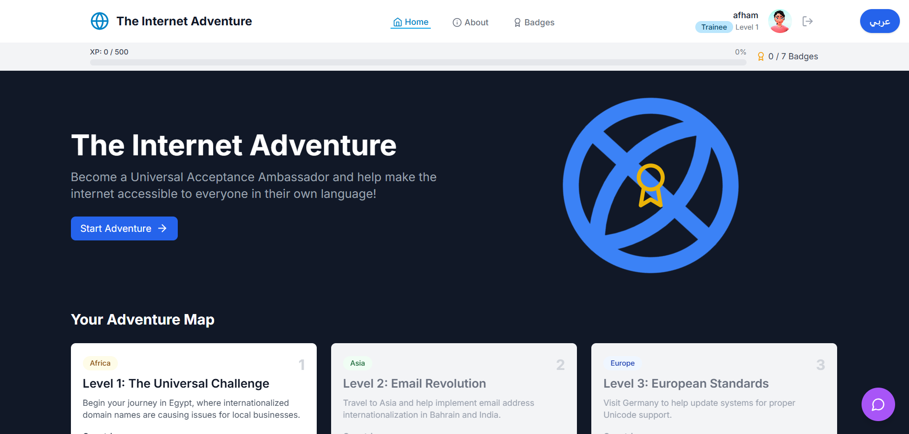
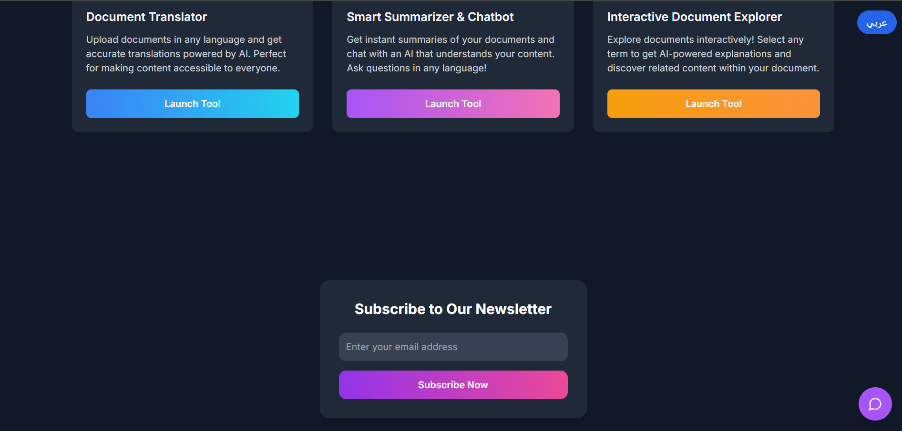
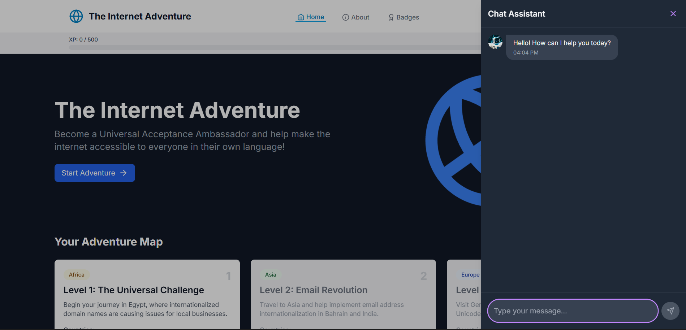
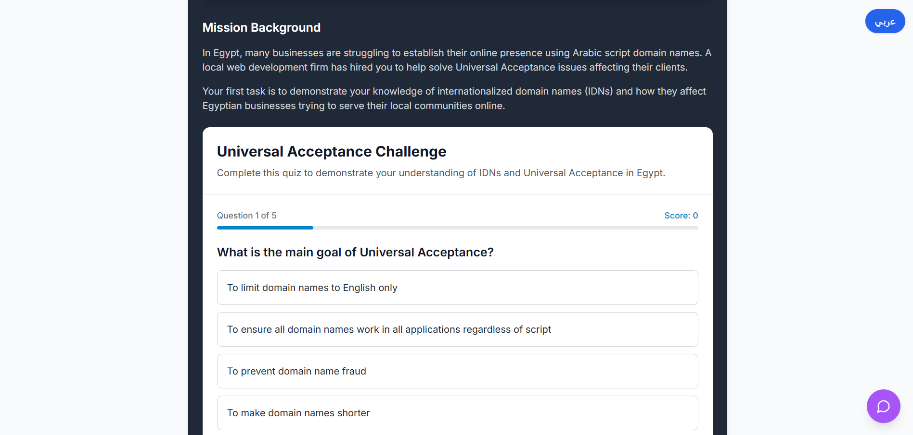
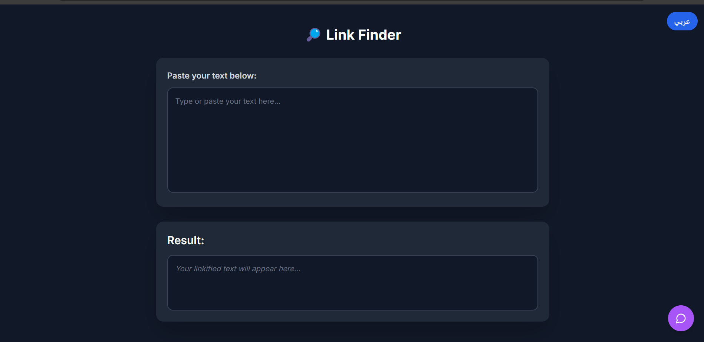

# 🌐 Universal Acceptance Awareness Website

A modern, responsive web platform designed to promote **Universal Acceptance (UA)**, especially for **Arabic domain names and email addresses**. Built with **React (Vite)**, hosted on **Vercel**, and powered by **Firebase** and **EmailJS**.

## ✨ Features

- 🔠 **Email validation and subscription** (supports Arabic/Unicode emails)
- 💬 **Interactive chatbot** for learning UA concepts
- 🔗 **Linkification of internationalized domains**
- 📨 **Confirmation emails** using EmailJS
- ☁️ **Firestore database integration**
- 🌍 **Fully localized (Arabic support)**

---

## 📸 Screenshots

### Landing Page

### Home 

###  Email Subscription

###  Chatbot

###  Quiz

### Linkification

---

## 🔧 Tech Stack

- **Frontend**: React + Vite + TailwindCSS
- **Backend**: Firebase Firestore
- **Email**: EmailJS

## 🧠 Learn More About Universal Acceptance (UA)

Universal Acceptance (UA) ensures that **all valid domain names and email addresses**, including those in **non-ASCII scripts (e.g., Arabic, Hindi, Chinese)**, work in all software applications.

### 🌍 Helpful Resources

- 🌐 [Universal Acceptance Steering Group (UASG)](https://uasg.tech)
- 🏢 [ICANN UA Program](https://www.icann.org/ua)
